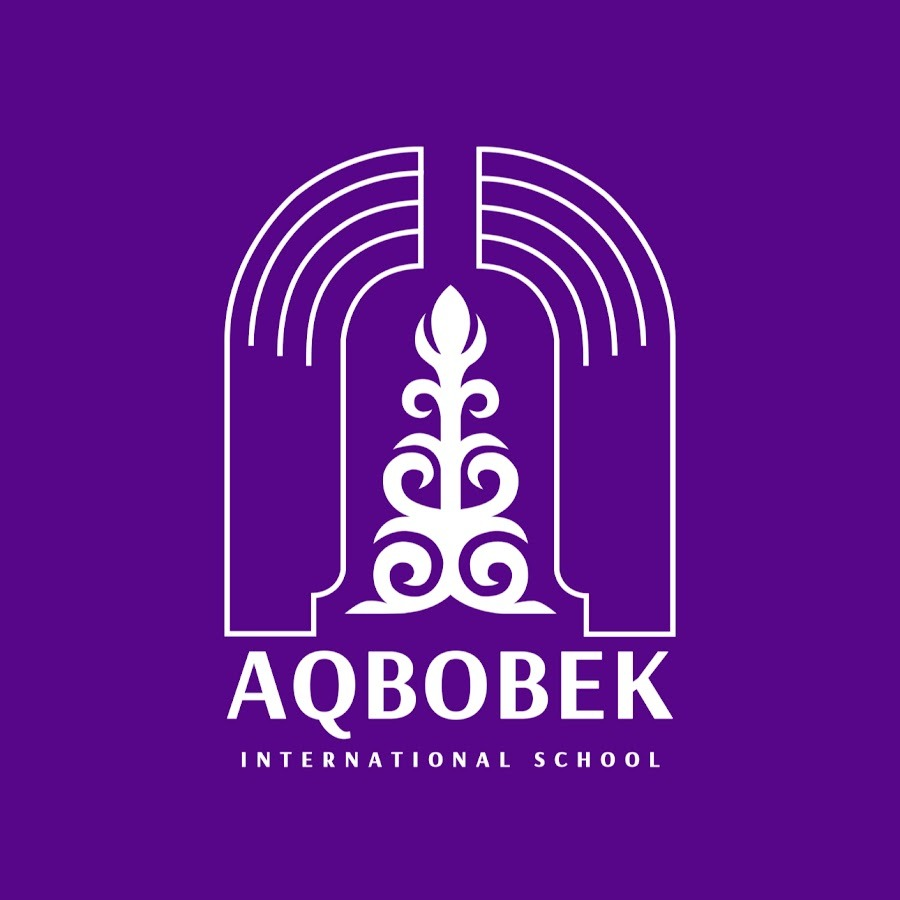

# АИС: Автоматизированная Информационная Система для Школы



Интеллектуальная система управления школой (School Management Dashboard) на базе ИИ. Проект создан в рамках хакатона для решения задач эффективного управления учебным процессом, составления расписания и контроля успеваемости.

## 🌟 Основные возможности

*   **Умное расписание (AI Scheduling):** Автоматическое распределение нагрузки учителей с учетом требований и нормативов (СанПиН, ТУП, Приказы МОН РК №76, №110, №130).
*   **Панель администратора / ученика / родителя:** Разделение ролей с уникальными функциями для каждого.
*   **ИИ-Аналитика:** Прогнозирование успеваемости, анализ оценок и достижений учащихся (RAG-модель).
*   **Интеграция с Telegram-ботом:** Уведомления, делегирование задач и расписание прямо в мессенджере.
*   **Многоязычность:** Поддержка русского, казахского и английского языков (RU/KZ/EN).

## 🛠 Технологии

*   **Frontend:** HTML, Vanilla CSS (`AIS.CSS`), JavaScript (`AIS.JS`) — отзывчивый интерфейс с поддержкой тёмной темы.
*   **Backend & AI:** Python (`ais.py`), обработка данных расписания, генерация через ИИ-модели.
*   **Данные:** JSON хранилища локальных данных, парсеры таблиц Excel.

## 🚀 Как запустить

### Веб-интерфейс
Просто откройте файл `ais.html` в любом современном браузере. Для работы локально не требуются сложные настройки сервера.

### Бэкенд и Telegram-бот
1. Убедитесь, что установлен Python 3.
2. Установите необходимые зависимости.
3. Запустите основной файл сервера/бота:
   ```bash
   python ais.py
   ```

## 📁 Структура проекта

* `ais.html`, `AIS.CSS`, `AIS.JS` — Frontend интерфейс (Панель управления)
* `ais.py` — Главный Python-скрипт бэкенда/AI
* `схемы и скрипты update_*.py` — Скрипты обновления расписания и баз данных
* `*.json` / `.txt` — Локальное хранилище данных и расписаний
* `*.xlsx` — Исходные файлы нагрузки и расписания для хакатона

---
*Разработано для Хакатона 2026 года.*
