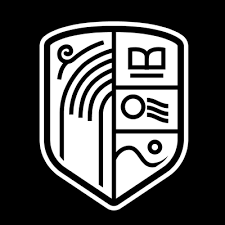

# АИС: Автоматизированная Информационная Система для Школы

Интеллектуальная система управления школой (School Management Dashboard) на базе ИИ. Проект создан в рамках хакатона для решения задач эффективного управления учебным процессом, составления расписания и контроля успеваемости.

## 🌟 Скорее зацените проект:
👉 [🔥 Нажмите здесь, чтобы открыть работающий веб-интерфейс!](https://dauletyernar-maker.github.io/AIS-3.0/AIS/ais.html)

*(Все исходники, скрипты на Python и база данных лежат выше в папке **AIS** ☝️)*

---

## 🛠 Ключевые возможности

*   **Умное расписание (AI Scheduling):** Автоматическое распределение нагрузки учителей с учетом требований и нормативов (СанПиН, ТУП, Приказы МОН РК №76, №110, №130).
*   **ИИ-Аналитика:** Прогнозирование успеваемости, анализ оценок и достижений учащихся (RAG-модель).
*   **Telegram-бот:** Делегирование задач и контроль расписания прямо в мессенджере.

**Стек технологий:** HTML, Vanilla CSS, JS | Python, RAG
